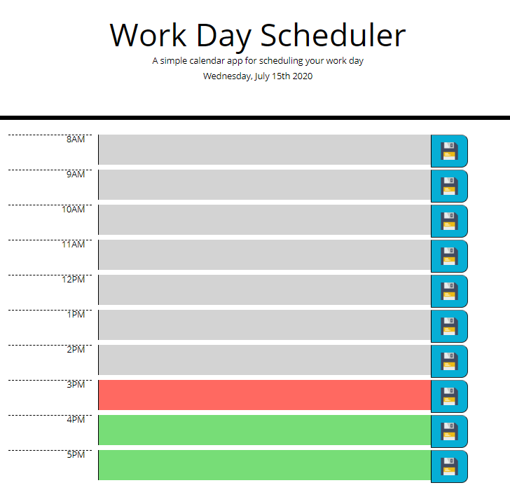
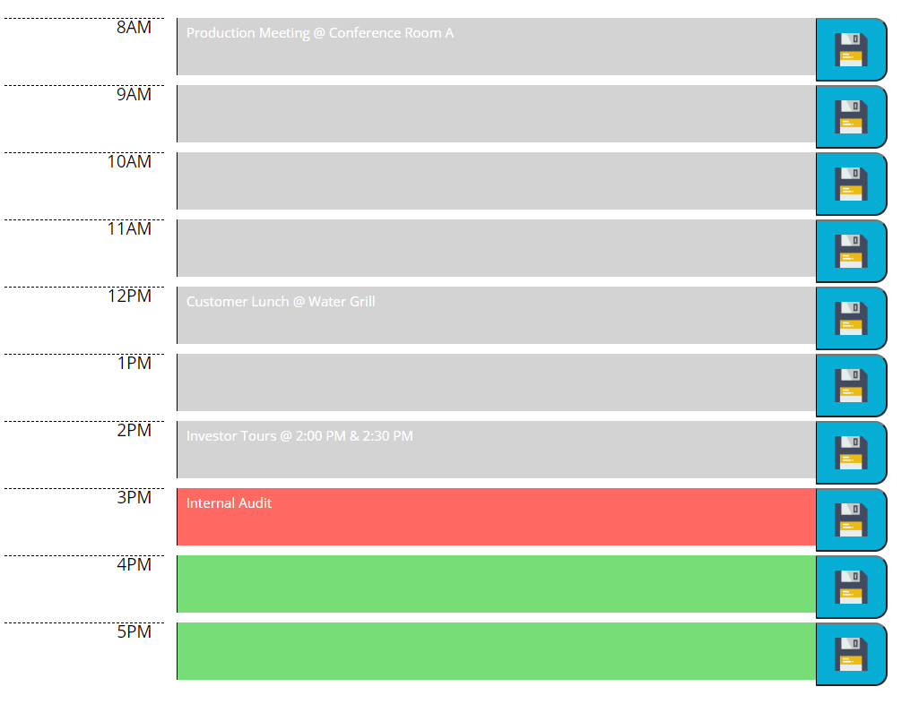

# Work Day Scheduler

This application allows for users to plan out their day by entering in their various tasks by the hour. The application itself is very visual in that any past hours will be highlighted in grey, the current hour highlighted in red, and any future hours highlighted in green. Throughout the day users can input and save their tasks without having to worry about the list being deleted. Note that users are allowed to input tasks into past hours. This is for the case that a user prefers to log their full day in order to review it properly. At the end of the day, the task list is cleared and the user can start fresh with a blank slate.

## Code Description

This code is set up to lean on existing HTML elements in order to color code and input saved tasks using JavaScript. The format of this page stays the same throuhout usage; this led to the decision to create majority of the structure in the HTML file as opposed to having JavaScript create the elements when needed. The code uses an array called taskList to store user saved data. The save occurs when the user clicks the corresponding save button and the saveTask() function is called. This function takes advantage of the "this" keyword to identify which button was clicked. From there, the function places the text from the text area into the proper index in the taskList array. The proper index is found using a data-index attribute added to each save button.

Upon opening the application, first there is a check for a locally saved taskList. If there the getItem() returns null, or the date has changed (stored in index 0 of the taskList array) then a new blank array is created with the current date placed into index 0. After that the updateSchedule() function is called. This function handles the color coding and adding of saved tasks to the textareas. It color codes based of a comparison between the current time and the time listed on the time blocks. The code uses the parseInt() function to turn the times into integers as well as convert them into military time in the afternoon. After the conversion, there is an if statement comparing the two numbers and depending on the hour, the addClass() function adds the appropriate class to the textarea. The classes for past, present, and future hours are prebuilt in the CSS file. 

## Link to Application & Demo

https://jandrews16.github.io/work-day-scheduler/

The following animation demonstrates the application functionality:

## Application Photos

Below is the application when first opened by the user. Note that the color coding will depend on what the current time is.

Below shows the page with a few tasks entered:

